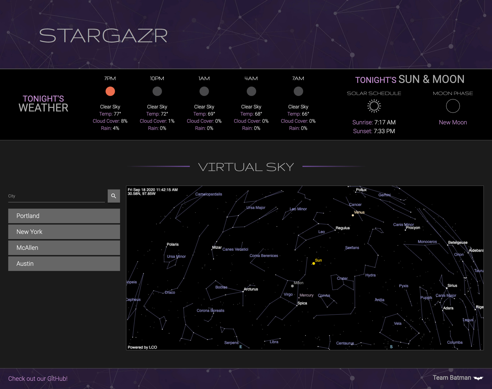

# Stargazr

## Purpose
Stargazr is an application for people to be able to see an overnight forecast and a current map of the sky at their location to plan a night of stargazing.

## Screenshot

## Technologies Used
- Materialzie
- jQuery
- Moment
- APIs
    - Open Weather
    - Farm Sense
    - Virtual Sky

## Links
[GitHub Repo](https://github.com/p1t2-batman/stargazr) 
[Deployed Application](https://p1t2-batman.github.io/stargazr/) 
[Presentation](https://docs.google.com/presentation/d/18rdom22gHDlY0Ofh3lIeRuf-v8V02SH5JQVRhjnUl1c/edit#slide=id.g4dc676206e_0_1218)
